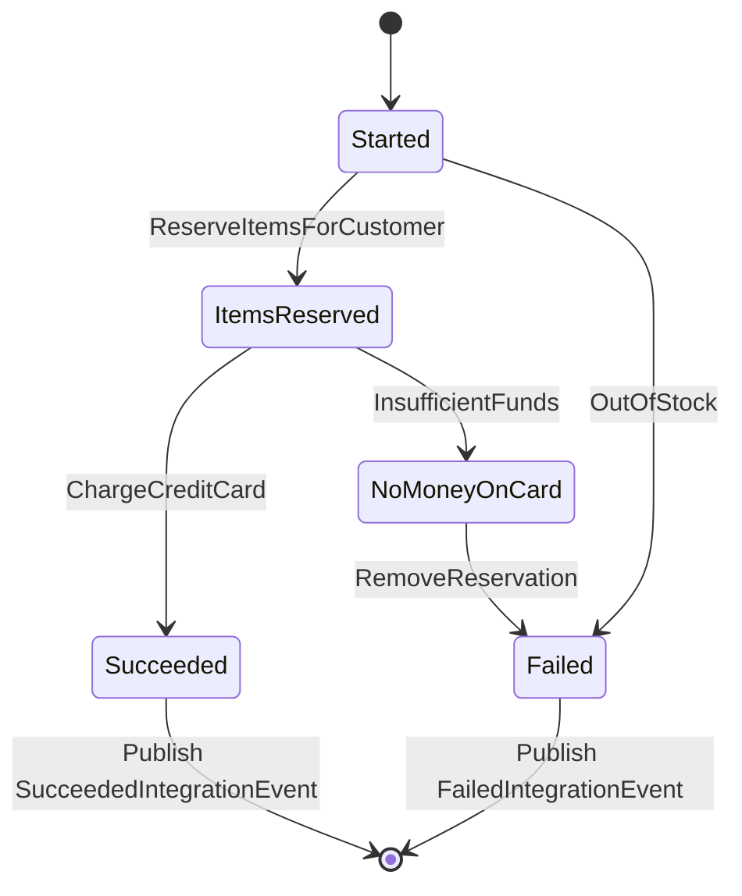

When building a backend using the microservices architecture you'll most likely find yourself in a situation where you need to execute a transaction or a business workflow that spans multiple services. Since each service has its own data store maintaining consistency is non trivial, if one of the individual transactions that make up the distributed transaction fails it is necessary to roll back everything to get back to a consistent state. A few data stores provides distributed ACID transactions via 2PC (two phase commits) but 2PC are notoriously difficult to work with, breaks service encapsulation and can have a serious impact on performance due to lock congestion. For these reasons it is common practice to embrace eventual consistency and implement distributed transactions using the saga pattern.



In [this definition](https://microservices.io/patterns/data/saga.html) of sagas used by Chris Richardson (and others) sagas can either be **orchestrated** or **choreographed**. A **choreographed** saga is just a name for a process where the state and responsibility for the process is distributed among multiple participating services. Each service is subscribing to a set of events and will reactively execute side effects and possibly publish new events to the event bus that will move the process forward.  This is an event driven approach that fosters a loose coupling between the services. Conversely an **orchestrated** saga is implemented by a single service that has the responsibility of keeping track of the state of the process, making calls to other services in a sequence of steps. This can result in a more tightly coupled architecture but the fact that the responsibility of the flow is anchored inside a single service makes it easier to debug and operate the sagas. Both approaches have their merits, it depends on what <a href="/blog/maintainability_part2/">responsibility boundaries</a> you need, but this particular post is about orchestrating sagas.



## Are sagas aggregates?

In the DDD community, sagas, often referred to as `process managers`, are often depicted as aggregates. They are part of the domain model and are representing a business process from the domain and, at the same time, responsible for orchestration by calling other aggregates. In my opinion this approach is a violation of the single responsibility principle. There are two separate responsibilities, the responsibility of modelling the business process and the responsibility of carrying out the orchestration. The reason these two responsibilities are often not separated in the literature is because the complexity of carrying out the orchestration is ignored in the toy examples, but in reality, it is not just a matter of "calling another aggregate". In real life there will be many subtle and purely technical orchestration issues that will need to be dealt with and if the orchestration responsibility is anchored inside the domain this will bleed into the domain model.

In my experience, unless your orchestration duties are very simple, this violation of the single responsibility principle will make your life harder than it should be, and my advice is to move the orchestration responsibilities out of the domain into a saga that is a purely technical construct and only has the responsibility of carrying out the orchestration and ensuring distributed consistency. If the business process you're modelling is complex it can make sense to represent this as a first class citizen in your domain, but you can still do that while keeping the responsibility of executing the orchestration in a separate saga implementation.

Consider this toy example:



Each node in the graph represents a state on the OrderFlowAggregate and each edge represents a transition between the states. When a customer wants to complete an order, the items are reserved to ensure they're in stock and the customer's credit card is charged. If the items are not in stock or the credit card fails the order fails. As the last step an integration event is published to notify other systems that the order has succeeded or failed.

Here's a naive implementation where the saga is implemented as event handlers on the OrderAggregate in go:


```go
type SagaHandler struct {
	publisher *Publisher
}

func (s *SagaHandler) HandleStarted(ctx context.Context, uow *UOW, started *Started) error {
	err := stockService.ReserveItemsForCustomer() // idempotent call to external service
	switch {
	case err == nil:
		return uow.Save(&ItemsReserved{})
	case errors.Is(err, OutOfStock):
		return uow.Save(&Failed{})
	}

	return err // this is a transient error, return error to retry
}

func (s *SagaHandler) HandleItemsReserved(ctx context.Context, uow *UOW, itemsReserved *ItemsReserved) error {
	err := cardService.ChargeCreditCard() // idempotent call to external service
	switch {
	case err == nil:
		return uow.Save(&Succeeded{})
	case errors.Is(err, InsufficientFunds):
		return uow.Save(&NoMoneyOnCard{})
	}

	return err // this is a transient error, return error to retry
}

func (s *SagaHandler) HandleNoMoneyOnCard(ctx context.Context, uow *UOW, failed *NoMoneyOnCard) error {
	err := stockService.RemoveReservation() // what if this fails with an unexpected BadRequest, how do we fix the broken flow?
	if err != nil {
		return err
	}
	return uow.Save(&Failed{})
}

func (s *SagaHandler) HandleSucceeded(ctx context.Context, uow *UOW, succeeded *Succeeded) error {
	return s.publisher.Publish(&SucceededIntegrationEvent{})
}

func (s *SagaHandler) HandleFailed(ctx context.Context, uow *UOW, failed *Failed) error {
	return s.publisher.Publish(&FailedIntegrationEvent{})
}

```

There are a few problems with this naive approach.

### Problem 1: Impedance mismatch between the DAG and the code

An orchestrating saga is essentially a DAG consisting of the set of tasks that needs to be taken and the transitions between them and ideally the code should reflect this. However in the approach depicted above the DAG is essentially modeled using reactive code and it is not immediately apparent how the tasks are connected to each other. This impedance mismatch, the misalignment between what is being modeled and how it is represented in the code makes it hard to read. It is quite difficult to get a holistic overview of the DAG because it requires jumping around the code base between different events and event handlers. One symptom I've seen of this is that teams would maintain UML diagrams of all the sagas that were implemented. These diagrams were necessary to help the developers understand the workflow, because it is simply too difficult (time consuming) to obtain a mental image of the workflow by reading the code itself.

The tiny toy example here does a bad job at illustrating this point because of its simplicity, but the problem will quickly become apparent in larger and more complex code bases.

### Problem 2: Business entity and the saga is modeled by the same object

The business entity and the saga is modeled by the same object which makes it difficult to separate orchestration problems from business problems. E.g. for async remote calls it is necessary to write two events related to the call to the event store. First an event representing the intention to make the call and the following representing the result of the call. I.e. we would have domain events in our event store such as, AsyncCallToXStarted. Obviously this means that if we needed to make changes to the orchestration for technical reasons, replacing an async API with a sync API, implementing the change would involve making changes to the event stream which is also used to represent the state of the business entity.

Another problem that I've encountered when the aggregate is modeled as an event sourced aggregate is how to handle event replay. Replaying events is a common practice in event sourcing which allows e.g. to rebuild views that are based on the events from the event store, however since the saga actions are implemented as event handlers on those events this can result in unwanted side effects as already completed sagas would then start making remote calls.

### Problem 3: Implementing orchestrating sagas is non trivial

Implementing orchestrating sagas is non trivial and operating a saga requires many capabilities that are not domain specific. It involves keeping track of the saga state, implementing retries and keeping track of stuck or failed sagas. A saga can get stuck due to some remote system not responding or an expected event not arriving, they can end up in an unexpected situation from which they can't progress needing human assistance. We find ourselves implementing the same patterns over and over again, e.g. implementing observability and endpoints that allow us to resume a stuck saga. E.g. what happens when the call fails because the other aggregate throws an unexpected error or there is a disagreement over the contract, how do you get the saga to continue once the issue or bug is gone?

## Orchestration challenges

Orchestration is hard and many subtle issues can arise that will need you to do ops work. The issues are very much generic in nature, they are common issues related to technical problems that can arise when doing orchestration and trying to maintain consistency in a distributed system. For these reasons it is probably a good idea to use a saga library to model the sagas because the saga library can provide functionality to address the generic issues that you will need to deal with. In the following sections I'll go through some of the common issues. I'll be referring to a saga library that we built in go that contained common functionality to help address the common issues that we encountered.

### Observability

Keeping track of failed or stuck sagas is obviously quite important. The saga library maintained a database table listing all sagas, a row in the table showed the active task and a lastUpdated timestamp for a saga. Failed sagas were sagas that had ended up in the special `FailWithUnknownError` state and stuck sagas were sagas that had not made a state change in a while. The information in this table was used as the basis for prometheus metrics that reported on stuck and failed transfers and once alerted we could consult this table to get an overview of which sagas were having issues.

The saga library was built using an in-house event sourcing library, that choice was not so much based on an opinion that modelling sagas using event sourcing was a good approach, but more on the fact that it was commonly used and we had a lot of experience with it. Using an event sourcing library meant that the entire saga history was automatically saved in the event store. This meant that in a debug scenario, apart from consulting the logs, if more details were needed regarding what data was sent or IDs used the saga event history could be consulted.

### Ops

Many different types of orchestration related errors can happen in production. Some of them may cause a saga to become stuck or take wrong decisions and it must be possible to rectify these situations. A bug in the saga code, e.g. it was not able to recognize a response code from an API, could cause it to end up in `FailWithUnknownError`. In this case the corrective action would be to fix the bug in the saga code (add support for the unexpected response code) and move the saga back to the task that failed to execute. Of course the bug that caused the saga to misbehave could also originate from one of the remote systems that the saga interacts with. This could e.g. cause an API call to fail unexpectedly making the saga jump to the special `FailWithUnknownError` state. Again this must be fixed by fixing the bug in the remote system and move the saga back to the task that failed to execute.

Much more complicated issues can arise. E.g. a bug can cause the saga to take wrong decisions and make incorrect remote calls, causing the distributed system to end up in an inconsistent state. In such situations it is often better to simply force complete the saga, and have a developer take over the responsibility for the state normally managed by the saga. If the APIs of the remote systems are available to be called manually the developer can make the corrective actions manually. The alternative, to enable the saga to get out of the situation by coding in the required flow will add complexity to the saga but since the situation was caused by a bug it is unlikely to ever end up in the same situation again so this part of the saga will not be useful later and only cause confusion to future developers who may not be familiar with the particular incident and understand why that particular behaviour is implemented.

A `mission control` API could be used to manually control the saga behaviour at runtime. Here we list some of the available methods.

- **Next Task**: Move the saga with the specified type and ID to the specified task.
- **Force Complete**: Force completes the saga.
- **Retry Task**: A saga is stuck in a task (it never moved to the next task, this can happen when using an `asyncTask`) and we'd like to manually retry it.
- **Update Data**: A bug in the saga code caused it to write some wrong data to its state. This method can be used to mutate the saga data.

The methods were exposed in our run script setup which has been described here <a href="/blog/reducing_run/">Running fast</a> This allowed us e.g. to quickly handle cases where many sagas had failed or gotten stuck due to the same reason, this was a simple matter of looping through the sagas in the saga overview table and calling the mission control function.

### Versioning

It is quite common to end up in a situation where it is necessary to make breaking changes to the saga flow. In this context breaking changes means a change to the saga flow that is incompatible with the existing flow, which means, if code changes were to be deployed while sagas using the old saga implementation were in-flight this would cause wrong behaviour. E.g.  changing the order of tasks or replacing one remote API with a another API could in some situations be breaking changes.

We supported versioning by attaching a version property to a DAG and allowing to register multiple DAGs of different versions to the same saga. A saga was triggered by the `sagas.Start` method which takes in a version parameter. To make breaking changes to a saga the developer workflow was to create a new version of the DAG and register it on the saga, change the code that starts the saga to use the new version, wait for all sagas that were based on the deprecated DAG to complete in production and finally remove the old DAG from the code.

If we had not built or used a saga framework then the saga implementations would have been entangled with the domain specific business logic. This means that figuring out how to make a breaking change to a saga flow would be a domain specific problem and would thus have to solved, in a new way, every time the problem arose.

### Postponement

Sometimes our sagas needed to wait for a period of time before continuing. This was also turned into a feature in the saga library that allowed a task to postpone itself for a specified period of time.

## Explicitly modeling the saga

In the below example we're constructing the saga explicitly using a saga library.

```go

  type SagaData struct {
    RememberThis string
  }

  var (
    sagaName            = types.Name("completeOrderFlow")
    saga                = factory.NewSaga(sagaName)
    reserveItems        = tasks.NewReserveItems()
    chargeCreditCard    = tasks.NewChargeCreditCard()
    removeReservation   = tasks.NewRemoveReservation()
    done                = commontasks.NewDoneTask(saga)
  )

  dag := sagas.NewDag[SagaData](types.UnspecifiedVersion)
  dag.StartFrom(reserveItems).
      Transitions(
        reserveItems.OnSuccess.GoTo(chargeCreditCard).OnFailure.GoTo(done),
        chargeCreditCard.OnSuccess.GoTo(done).OnFailure.GoTo(removeReservation),
        removeReservation.OnSuccess.GoTo(done),
  )

  saga.RegisterDag(dag)
```

Notice how the DAG is explicitly expressed in the code. Also notice that each task is implemented as a separate type. We keep each task in a separate go file and this means that it is easy to get an overview of which tasks exist when looking at the code in the tree navigator. It becomes immediately apparent to the reader that there is a concept called a saga and a task when looking at the folder structure, which was certainly not the case previously where the saga and tasks were buried within events and event handlers. This is an example of applying the principle of [screaming architectures](https://blog.cleancoder.com/uncle-bob/2011/09/30/Screaming-Architecture.html)

Also notice how the saga and DAG construction is separated. A DAG is constructed and registered on the saga. This will make it possible to handle versioning by registering multiple DAGs on the same saga.

The saga is initiated by an event handler on the `Started` domain event on the `Order` aggregate:

```go
func (o *SagaStarter) HandleStarted(ctx context.Context, event *Started) error {
  return o.saga.Start(ctx, event.OrderID) // use the OrderID as the saga ID
}
```

Next let's take a look at how the tasks are implemented. The `ReserveItems` task declares two connectors, OnSuccess and OnFailure. In the implementation of Execute it will, based on the outcome of the side effect that is executed, decide where to go next, to the OnSuccess or to the OnFailure task. The connectors has two type arguments, one being the SagaData type which must correspond the SagaData type on the saga and an Args type which is the type of arguments that the task can take. The connectors allow us to reuse a saga task implementation in multiple sagas by simply plugging in different tasks in the connectors when constructing the DAGs.

```go
type ReserveItems struct {
  *sagas.Task[SagaData]

  OnSuccess *sagas.Connector[SagaData]
  OnFailure *sagas.Connector[SagaData]
}

func NewReserveItems(
) *ReserveItems {
  task := &ReserveItems{
    Task: sagas.NewTask[SagaData](),
  }
  task.OnSuccess = sagas.NewConnector[SagaData](task)
  task.OnFailure = sagas.NewConnector[SagaData](task)

  return task
}

func (i *ReserveItems) Execute(ctx context.Context) (sagas.Command[SagaData], error) {
	err := i.stockService.ReserveItemsForCustomer() // idempotent call to external service
	switch {
    case err == nil:
      // all good, follow the happy path
      return sagas.Next(i.OnSuccess.Resolve(state)), nil
    case errors.Is(err, OutOfStock):
        // well that didn't work, we must follow the rainy day path
        return sagas.Next(i.OnFailure.Resolve(state)), nil 
	}

	return err // this is a transient error, return error to retry
}
```

The example here is leaving out several details, e.g. the `ReserveItems` task would need to load the state of the `Order` aggregate and pass in data from the aggregate state to the call to the stock service, but it's left out for brevity.

The `removeReservation` task has a single connector, OnSuccess, there is no OnFailure connector as there is no expected way it can fail. If it fails for unexpected reasons the task will move the saga into the `FailedWithUnknownError` state. This is a special state that all sagas can end up in. The `FailedWithUnknownError` state is used to handle all the situations that cannot be handled automatically, either because they were unexpected and therefore the saga code did not take that scenario into consideration, or because there simply is no supported way to handle the situation automatically.
 When a saga is in that state it must be moved out of the state manually by calling one of the methods on the `mission control` API that we've mentioned previously.

```go
type RemoveReservation struct {
  *sagas.Task[SagaData]

  OnSuccess *sagas.Connector[SagaData]
}

func NewRemoveReservation(
) *RemoveReservation {
  task := &RemoveReservation{
    Task: sagas.NewTask[SagaData](),
  }
  task.OnSuccess = sagas.NewConnector[SagaData](task)

  return task
}

func (i *RemoveReservation) Execute(ctx context.Context) (sagas.Command[SagaData], error) {
	err := i.stockService.RemoveReservation()
    if err != nil {
      if errors.Is(err, BadRequest) {
        // something really unexpected happened, I have no idea what to do now!
        return sagas.FailWithUnknownError[SagaData](err.Error()), nil
      }
      // this error is probably retriable
      return nil, err
    }    
	return sagas.Next(i.OnSuccess.Resolve(state)), nil // reservation removed successfully, move to next task
}
```

Notice that if for some reason the saga framework fails to persist the decision about where to go next this will also result in the call to Execute to be automatically retried. Therefore it is essential that the side effect carried out in the Execute method is idempotent.

The `commontask.Done` is provided by the library and simply completes the saga:

```go
type Done[Data any] struct {
	*sagas.Task[Data]
}

func NewDoneTask[Data any]() *Complete[Data] {
	return &Done[Data]{
		Task: sagas.NewTask[Data](tasknames.Done),
	}
}

func (task *Done[Data]) Execute(ctx context.Context, sagaState *saga.State[Data]) (sagas.Command[Data], error) {
	return sagas.Complete[Data](), nil
}
```

Instead of transitioning to the Done task the `ReserveItems` could simply have completed the saga when it was done by calling `sagas.Complete()` itself. The benefit of having `ReserveItems` transition to the `Done` task and let `Done` complete the saga is that if we later need to refactor the saga in a way where `ReserveItems` is no longer the last task in the saga we won't have to make changes to `ReserveItems` to make it work, we can simply rewire the connectors, i.e. it makes the `ReserveItems` adhere to the Open/Closed principle.

Finally observe that there is no longer a NoMoneyOnCard domain event needed on the Order aggregate. It might still be relevant for domain specific reasons but it is not required to implement the saga. The Order aggregate now will only contain the domain events that are relevant to the domain. Also notice that the saga is not publishing integration events, this is kept separate as event handlers on the domain event as it has nothing to do with the saga.

## Conclusion

As this post hopefully demonstrates orchestration is a non trivial problem and many of the challenges that arise are of a generic nature. Moving away from a domain specific approach to using a generic library allowed us to save a lot of time and if you have to deal with a lot of orchestration it is something that I can definitely recommend.
